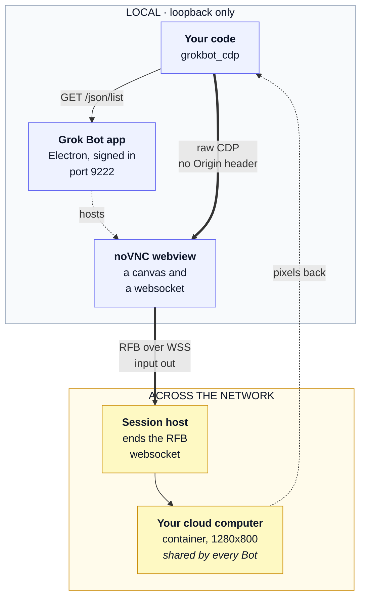

# CDP transport: reaching the machine, and where the network boundary sits

This shard answers two questions. How does a process on this machine reach the
remote screen at all, and what is on which side of the network boundary. If you
are here to find out why Playwright shows nothing, why the websocket handshake
sends no `Origin` header, or what actually crosses to the cloud computer when
you write a credential to it, you are in the right place. What the machine is
once you are on it, and the input quirks of driving it, live elsewhere.

## The path: CDP to the Electron app, then its noVNC webview

Grok Bot gives each account a persistent cloud machine with a browser, a
filesystem and a terminal, and exactly one documented way to use it: message
the Bot. There is no API. The route this library takes is a different one. The
desktop app is Electron, so it will open a Chrome DevTools port, and the
machine turns out to be delivered through a noVNC session inside one of its
webviews. Attach to that target and you can read the screen and send input.

Four hops, and only the last two leave this machine. The two that matter are
the raw CDP websocket, which carries `Input.dispatchKeyEvent`,
`Input.dispatchMouseEvent` and `Page.captureScreenshot`, and the RFB websocket
underneath it, which is what noVNC turns those events into.

Read the diagram as two boxes with a line between them. Everything in the left
box is loopback traffic on the machine you are sitting at: your code talking to
the app's debugging port, and the app hosting the webview that holds the noVNC
canvas. Everything in the right box is somewhere else: the session host that
terminates the RFB websocket, and the container behind it that is the cloud
computer itself. The only two hops that cross between them are the RFB
websocket carrying your input out, and the pixels coming back.

## Where the credential boundary sits

The app's login never leaves the left box: this library does not handle sign-in
and never reads the session. The debugging port is loopback only, but it is a
debugging port into a signed-in application, so close the app when a run
finishes.

Anything `write_env_file` puts on the machine crosses to the right box and lands
somewhere **every Bot on the account can reach**, along with their files,
browser sessions and app logins. That is the boundary worth being careful at.

The asymmetry is the point. Sign-in state stays local whether you think about it
or not, because nothing in this library touches it. A credential you deliberately
place on the machine is the opposite: it is the one thing you personally push
across the boundary, into a shared environment, and once it is there its blast
radius is whatever that credential can do, not whatever you intended to use it
for. Everything about putting a secret there, echo suppression, file mode, quote
handling, and how narrow the credential should be in the first place, follows
from this one fact about which side it ends up on.

## Playwright cannot see the machine

`connect_over_cdp` lists page targets; the machine is an Electron `<webview>`,
which it does not surface. Attaching with Playwright shows the app's renderer
and nothing else.

The failure is quiet and it looks like success. The connection is established,
the target list comes back populated, and you are looking at a real page. It is
simply the wrong page: the app's own renderer, with no sign anywhere in the
listing that another target exists behind it. There is no error to catch and no
empty result to branch on, so an attempt built on Playwright reads as working
right up to the point where every screenshot shows the app chrome instead of a
desktop.

Raw CDP to the webview's own websocket is the only route. That is why this
library carries a small protocol client of its own instead of wrapping a browser
automation framework. The framework is not too heavy for the job; it cannot do
the job.

## The websocket handshake needs no Origin header

Chrome answers a DevTools websocket carrying `Origin` with `403 Rejected an
incoming WebSocket connection from the http://127.0.0.1:9222 origin`, and names
`--remote-allow-origins` in the message.

There are two ways through. Relaunching the app with that flag works, and so
does simply not sending the header. This library sends none.

Taking the flag at its word is the tempting move, because the error message
itself suggests it, and it is the wrong one: it makes correct operation depend
on the app having been started a particular way, so anything that restarts the
app without the flag breaks the connection, and the only visible symptom is the
same 403. Sending no `Origin` at all has no such dependency. It works against an
app launched any way at all, including one the user started themselves before
your code ran.
